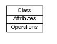
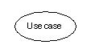
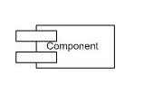
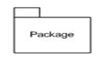
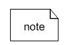
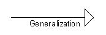
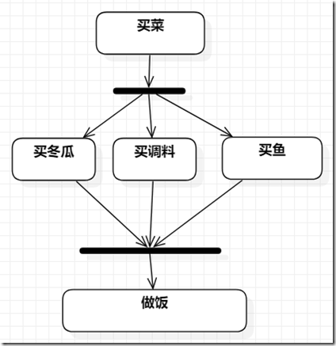

## 可用图类型

## UML三大要素

- UML构建模块
- 规则连接构建模块
- UML的公共机制

本节讲解 UML 构建模块的所有要素，UML 的构建块的定义如下：

- 事物
- 关系
- 图

### （1）事物:

事物是是实体抽象化的最终结果，是 UML 构建块最重要的组成部分，事物的分类如下:

- 结构事物
- 行为事物
- 分组事物
- 注释事物

### 结构事物:

结构事物是模型中的静态部分，用以呈现概念或实体的表现元素，是软件建模中最常见的元素，接下来是对结构化物件的简要描述：

### 类

类是指具有相同属性、方法、关系和语义的对象的集合；

### 接口

接口是指类或组件所提供的服务（操作），描述了类或组件对外可见的动作；

### 协作

协作定义元素之间的相互作用；

### 用例

用例定义了执行者（在系统外部和系统交互的人）和被考虑的系统之间的交互来实现的一个业务目标；

### 组件

组件描述物理系统的一部分；

### 节点

一个节点可以被定义为在运行时存在的物理元素；

### 行为事物:

行为事物指的是 UML 模型中的动态部分，代表语句里的 "动词"，表示模型里随着时空不断变化的部分，包含两类：

### 交互:

交互被定义为一种行为，包括一组元素之间的消息交换来完成特定的任务。

### 状态机:

状态机由一系列对象的状态组成，它是有用的，一个对象在其生命周期的状态是很重要的。

### 分组事物:

可以把分组事物看成是一个"盒子"，模型可以在其中被分解。目前只有一种分组事物，即包（package）。结构事物、动作事物甚至分组事物都有可能放在一个包中。包纯粹是概念上的，只存在于开发阶段，而组件在运行时存在。

### 包:

封装是唯一一个分组事物可收集结构和行为的东西。

## 注释事物:

注释事物可以被定义为一种机制来捕捉UML模型元素的言论，说明和注释。注释是唯一一个注释事物。

## 注释:

注释用于渲染意见，约束等的UML元素。

### (2) 关系 :

关系是另一个最重要的构建块UML，它显示元素是如何彼此相关联，此关联描述的一个应用程序的功能，UML中定义了四种关系：

### 依赖关系:

依赖是两件事物之间的语义联系，其中一个事物的变化也影响到另一个事物。

### 协作:

一种描述一组对象之间连接的结构关系，如聚合关系（描述了整体和部分间的结构关系）；

### 泛化:

泛化可以被定义为一个专门的元件连接关系与一个广义的元素，它基本上描述了在对象世界中的继承关系，是一种一般化-特殊化的关系；

### 实现:

类之间的语义关系，其中的一个类指定了由另一个类保证执行的契约。

### (3) UML图:

UML 图的整个讨论的最终输出所有要素，关系用于使一个完整的UML图，图中表示的系统。

UML 图的视觉效果是整个过程中最重要的部分。

图是事物集合的分类，UML 中包含多种图：

1. 类图：类图描述系统所包含的类、类的内部结构及类之间的关系；
2. 对象图：对象图是类图的一个具体实例；
3. 用例图：用例图从用户的角度出发描述系统的功能、需求，展示系统外部的各类角色与系统内部的各种用例之间的关系；
4. 顺序图：顺序图表示对象之间动态合作的关系；
5. 协作图：协作图描述对象之间的协作关系；
6. 活动图：活动图描述系统中各种活动的执行顺序。
7. 状态图：状态图描述一类对象的所有可能的状态以及事件发生时状态的转移条件；
8. 部署关系图：部署关系图定义系统中软硬件的物理体系结构；
9. 组件图：组件图描述代码部件的物理结构以及各部件之间的依赖关系；

## UML建模类型

### （1）结构建模:

结构建模具有捕捉静态的功能，包括下列各项：

- 类图
- 对象图
- 部署图
- 包图
- 复合结构图
- 组件图

结构模型代表的系统架构，这个框架的所有其他组件存在的地方。因此，类图，组件图和部署图的部分结构建模。它们都代表的元素和机制将它们组装。

但是，从来没有的结构模型描述系统的动态行为。类图中是最广泛使用的结构图。

### （2）行为建模:

行为建模描述了在系统中的相互作用，代表之间的交互的结构图，行为建模显示系统的动态性质，包括下列各项：

- 活动图
- 交互图
- 用例图

所有上述的显示在一个系统中流动的动态序列。

### （3）架构建模:

架构建模表示的是一个系统的总体框架，它包含了系统的结构和行为的元素。架构建模可以被定义为整个系统的蓝图。包图是根据架构模型进行的。

## 活动图

 UML 活动图目的描述：

- 绘制活动流程系统。
- 描述的顺序从一个活动到另一个。
- 描述系统并行，分支，并发流。

a、活动状态图(Activity)、动作状态(Actions)

活动和动作使用同一个图表示，活动状态与状态机的状态是同一个意思，代表着一种状态，它是由别的状态流转而来，也可以流转到别的状态，同时也可以自流转，流转到自己；动作状态代表的就是一个动作。

活动状态图，是可以细化的，所以有时候会先画一个大的活动状态图，然后将该活动暴露的接口和所使用到的接口都在这个图里标识好，然后再在这个活动图里细化相应的逻辑。

内部填充具体的支付系统逻辑，更详细的案例，见文末案例e。

b、动作流(Control Flow)

即动作之间的转化，由一根连线将两个动作状态图连接起来。

c、开始节点(Initial)

即活动开始的节点。

d、终止节点(Final nodes)

终止节点分为活动终止节点和流程终止节点；

活动终止节点，代表着整个活动结束了，不会有其他的分支在跑。

流程终止节点，代表着某个流程结束了，其他流程还在跑，整个活动还没有终止。

e、对象(object)

对象属于数据流的一部分，用矩形框表示。

f、数据存储对象(DataStore)

使用关键字<<datastore>>。

g、对象流(Object Flow)

对象流实际上是控制流中插入对象，以表达对象、动作和状态之间的关系。

具有以下特征：

(1) 一个对象可以由对个动作操作；

(2) 一个动作输出的对象可以作为另一个动作的输入对象；

(3) 在活动图中，一个对象可以出现多次，它的每一次出现代表着对象分处于生命周期的不同状态。

对象流中的对象名称分为两部分，一部分是对象名，下面是对象的状态，如果一个对象不存在多个状态，那么下面的状态表示可以去除掉。(暂时不知道怎么将状态写到下面，只能写在右边)

h、分支和合并（Decision Merge）

分支和合并公用一个图形，该图形有多个出口也有多个入口，每个出口都用对应的条件标识，类似于编码中的if else 或者 switch case，每个分支都是条件的。

i、分叉和汇合(Fork Join)

分叉和汇合与分支和合并类似，但有本质区别，否则是状态流转与条件挂钩，一次只能走一条路，但是分叉和汇合则是并行的，每次每条路都要走，它表示的不是说多条路选一条的意思，而是多条路要同时走。

分支和分叉因为前者入口都标有条件而后者没有标，所以容易区分，但是合并和汇合非常类似，入口都是没有条件的，**区分的方法就是 所有入口是不是相斥的，如果是就是合并，后者就是汇合**。

j、信号（Signal）

信号分为两种，一种是接收信号，一种是发出信号，还有一种比较特殊，时间事件，有的地方也把这个叫做时间信号

时间信号，本质上是在表示一种时间动作，一般是表示等待

接收信号大部分情况下不用画，直接由发出信号指向活动或者动作图。

2、泳道

泳道图出自 跨职能图，每个泳道代表着不同的组织、系统或者是个人，泳道里的图代表着该组织所负责的逻辑，在活动图里也是一样，在信号部分，就用到了泳道。

3、案例

a、购物用例图

b、 **带有发送信号与接收信号的活动图**

这个案例中，左上角用的是汇合，用错了，应该采用合并，因为有空位和没有空位是相斥的，才能采用合并。

c、带对象流的活动图

d、辅助活动图

e、典型案例

