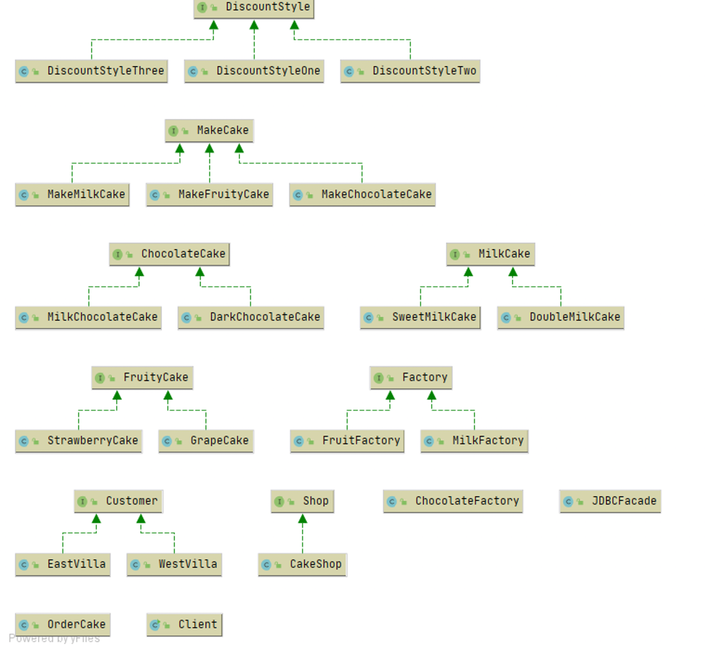
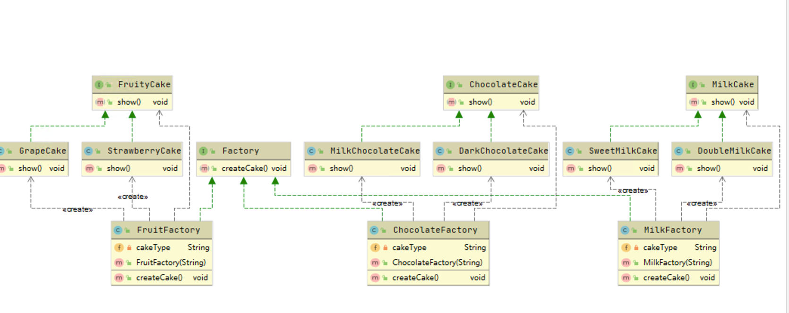
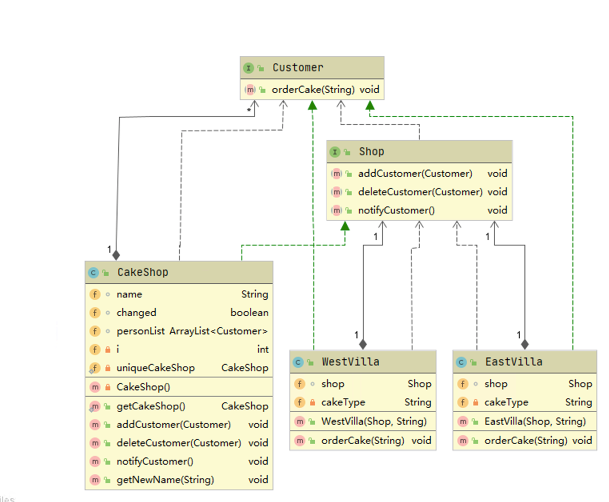

# 设计模式期末报告

## 程序源代码

### 1、测试类

```java
public class Client {
	public static void main (String arg[]){
		CakeShop starCakeShop = CakeShop.getCakeShop();
		
		new WestVilla(starCakeShop, "草莓水果");		
		starCakeShop.getNewName("西13");
		starCakeShop.notifyCustomer();	
		OrderCake cake = new OrderCake();
		System.out.println("今日促销一律8折优惠");	
		cake.setM(8);
		cake.setStyle(new DiscountStyleThree());
		cake.setPrice(80) ;
		System.out.println("本次订购成功完成，需要支付的金额为"+cake.getMoney(cake.getPrice(),cake.getM())+"，原价80");
		System.out.println("=================================");
		
		new EastVilla(starCakeShop, "甜奶");
		starCakeShop.getNewName("东18");
		starCakeShop.notifyCustomer();	
		System.out.println("=================================");
		
		starCakeShop.getNewName("东12");
		starCakeShop.notifyCustomer();
	}
}

```

### 2、折扣的接口和方法（策略模式）

接口 DiscountStyle.java：

```java
public interface DiscountStyle {
public double disCount(double price,double m);
}

```

折方式一 DiscountStyleOne.java：

```java
public class DiscountStyleOne implements DiscountStyle{
public double disCount(double price,double m) {
	return price;
}
}
```

打折方式二 DiscountStyleTwo.java：

```java
public class DiscountStyleTwo implements DiscountStyle{
public double disCount(double price,double m) {
	price = price - m;
	return price;
}
}
```

打折方式三 DiscountStyleThree.java：

```java
public class DiscountStyleThree implements DiscountStyle{
public double disCount(double price,double m) {
	price = price * m/10;
	return price;
}
}
```








